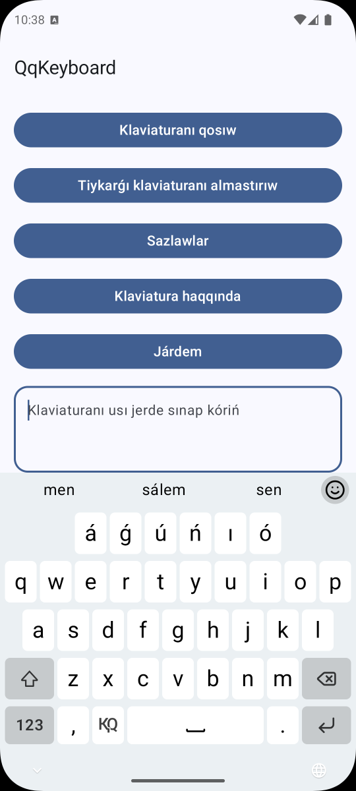
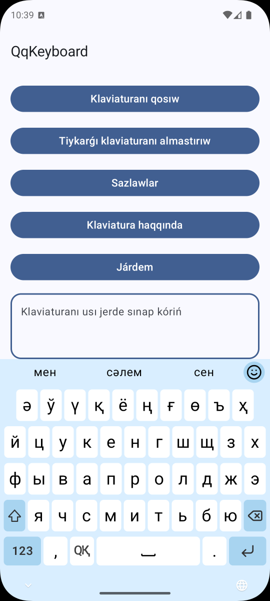
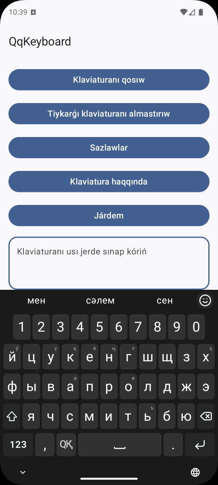
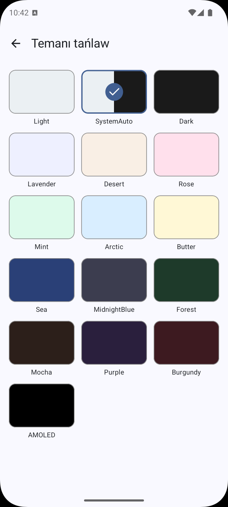

# QqKeyboard

A virtual keyboard for Android with dual Latin (Q) and Cyrillic (Қ) layouts for the Karakalpak language.

[](https://play.google.com/store/apps/details?id=com.shagalalab.qqkeyboard)

## Screenshots

<!-- Add screenshots to the /screenshots directory and update the paths below -->
| Latin layout | Cyrillic layout | Dark theme | Themes |
|---|---|---|---|
|  |  |  |  |

## Features

- **Dual layout** — switch between Latin (QQ) and Cyrillic (ҚҚ) Karakalpak layouts with one tap
- **Top row options** — show numbers or extra Karakalpak letters (á, ǵ, ń…) in the first row
- **Emoji picker** — full emoji support with recent emoji tracking
- **Themes** — Light, Dark, System Auto, and a few more colorful ones
- **Smart typing** — auto-capitalization, double-space to period, auto-remove space before punctuation
- **Adjustable feedback** — configure vibration strength and key click sound independently
- **Key borders** — toggle key border visibility
- **Keyboard height** — choose between Default and Short layouts
- Requires Android 8.0 (API 26) or higher

## Setup

Keyboard apps require two steps to activate after installation:

**1. Enable the keyboard**

Go to *Settings → System → Language & input → On-screen keyboard* and enable **QqKeyboard**.

**2. Set as default**

Tap the keyboard icon in the navigation bar (or go to *Settings → System → Language & input → Current keyboard*) and select **QqKeyboard**.

## Build

```bash
# Debug build
./gradlew assembleDebug

# Install on connected device
./gradlew installDebug
```

## Architecture

Built entirely with Jetpack Compose (no XML layouts). Key components:

| Component | Location | Role |
|---|---|---|
| `QqKeyboardService` | `keyboard/service/` | `InputMethodService` — keyboard lifecycle |
| `KeyboardViewModel` | `keyboard/viewmodel/` | State management, key press logic |
| `QqKeyboard` | `keyboard/compose/` | Root Compose UI |
| `KeyboardMappings` | `keyboard/data/` | Latin and Cyrillic layout definitions |
| `KeyboardPreferences` | `keyboard/preferences/` | SharedPreferences wrapper |

## License

[MIT License](LICENSE)
